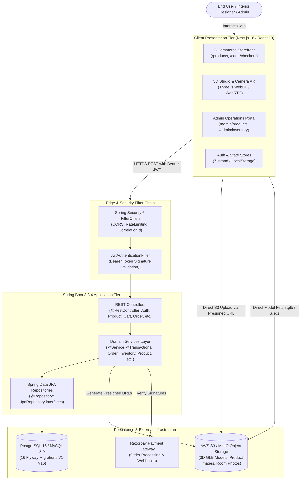
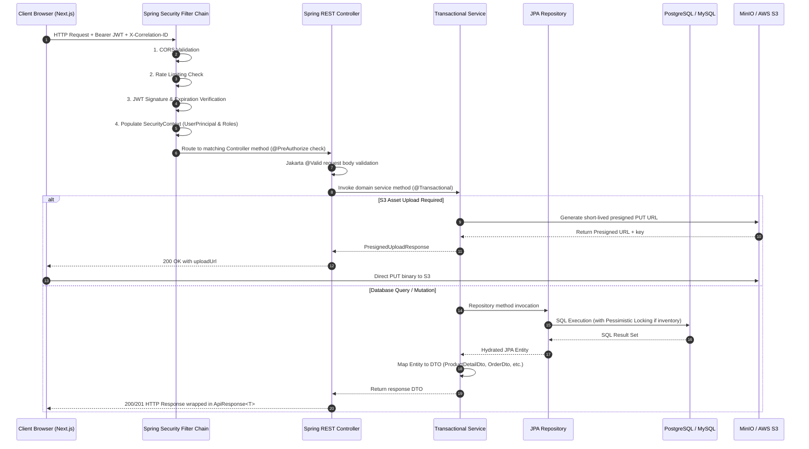

# 04. System Architecture

This document provides a comprehensive analysis of the architectural layers, network protocols, data flows, and security boundaries across the FunArray platform.

---

## 1. High-Level Architecture Overview

FunArray is engineered as a modern, decoupled web application with a stateless backend, an interactive client-side 3D rendering engine, and relational persistence.

---

## 2. End-to-End Request Lifecycle

Every HTTP request follows a structured, deterministic lifecycle from client interaction to database persistence:

---

## 3. Layer Responsibilities & Boundaries

### 3.1 Client Tier (`frontend/`)
* **Technology:** Next.js 16.3.6 (App Router), React 19.2.8, TypeScript 5, Three.js 0.186.1, Tailwind CSS v4, Zustand 5.0.15.
* **Responsibilities:**
  * Interactive UI rendering and responsive mobile-first layouts.
  * WebGL 3D rendering of furniture models and room backgrounds.
  * WebRTC live camera streaming for augmented reality floor plane detection.
  * Client-side session and cart caching with automatic synchronization.
  * Silent JWT refresh via interceptors in `fetchWithAuth`.

### 3.2 Gateway & Security Tier (`backend/src/main/java/com/furniture/store/config/`)
* **Technology:** Spring Security 6, JJWT 0.12.6, Servlet Filters.
* **Responsibilities:**
  * **CORS Policy:** Strict allowed origins (`http://localhost:3000`, `http://localhost:3001`, `*.vercel.app`).
  * **Rate Limiting:** IP-based request throttling.
  * **Correlation Tracing:** `CorrelationIdFilter` attaches `X-Correlation-ID` for end-to-end log diagnostics.
  * **Token Authentication:** `JwtAuthenticationFilter` validates stateless HMAC-SHA256 tokens and checks token revocation status against `TokenBlacklistService`.

### 3.3 Application Tier (`backend/src/main/java/com/furniture/store/`)
* **Technology:** Java 21, Spring Boot 3.3.4 (Spring Web MVC, Spring Data JPA, Spring Validation).
* **Responsibilities:**
  * Encapsulates all domain business rules.
  * Enforces state machine transitions on orders (`PENDING` → `CONFIRMED` → `PROCESSING` → `SHIPPED` → `DELIVERED`).
  * Manages real-time stock reservations using pessimistic locking (`SELECT ... FOR UPDATE`).
  * Computes authoritative checkout pricing (subtotal, 18% GST tax, shipping, and coupon discounts).
  * Validates Razorpay webhook cryptographic signatures.

### 3.4 Data & Storage Tier
* **Technology:** PostgreSQL 16 / MySQL 8.0, Flyway Migrations, AWS S3 / MinIO.
* **Responsibilities:**
  * **Relational System of Record:** 16 versioned Flyway tables managing users, categories, products, variants, images, 3D models, inventory, carts, orders, payments, reviews, physical stores, and room designs.
  * **Object Storage:** Unstructured binary assets (GLB models, high-resolution product photos, user room scans).

---

## 4. Key Architectural Patterns

1. **Server-Authoritative Commerce:** Client calculates indicative pricing for UX; backend re-computes subtotal, tax, shipping, and discounts during checkout preview and execution.
2. **Pessimistic Inventory Ledger:** Prevents race conditions during simultaneous customer checkouts by locking variant inventory rows during reservation.
3. **Direct-to-S3 Presigned Uploads:** Offloads heavy file transfer traffic (high-resolution GLB models and 4K room photos) from the Spring Boot application server directly to AWS S3 / MinIO.
4. **Resilient Offline / Demo Fallbacks:** Frontend API clients include robust fallback mock datasets so the storefront remains testable even when backend services are offline.
