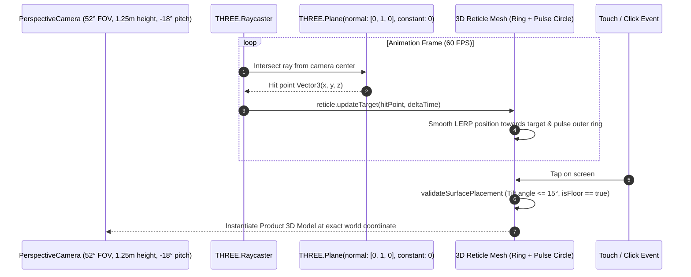

# 13. AR and 3D Visualization Documentation

This document provides a comprehensive engineering guide to the spatial computing, 3D WebGL rendering, and augmented reality (AR) systems implemented in FunArray.

---

## 1. Technologies & Architecture

FunArray features two distinct spatial visualization engines:
1. **Interactive 3D Room Studio (`RoomViewer.tsx`):** A browser-based WebGL staging canvas supporting room photo backdrops, 2D horizon floor pitch calibration, multi-model placement, dimension locking, and scene serialization.
2. **Live Mobile Camera AR Engine (`CameraARViewer.tsx`):** A real-time WebRTC camera feed paired with a transparent Three.js WebGL overlay, surface raycasting, animated green placement reticle, WebXR depth-sensing occlusion hooks, and micro-nudge positioning controls.

| Component | Library / API | Responsibility |
| :--- | :--- | :--- |
| **WebGL Renderer** | Three.js `v0.186.1` | PBR material rendering, directional lighting, soft shadow mapping, and bounding box math. |
| **Asset Formats** | GLTF 2.0 (`.glb`) & USDZ (`.usdz`) | Compact binary format storing geometry, PBR textures (normal, roughness, metallic), and physical dimensions. |
| **Camera Feed** | WebRTC `MediaDevices.getUserMedia` | Streams 1080p environment camera video to HTML5 `<video>` element with zero server persistence. |
| **Surface Tracking** | `ARSurfaceManager.ts` | Raycasts onto mathematical floor plane with smooth target LERP interpolation. |
| **Real-World Occlusion** | `ARDepthOcclusion.ts` | Custom GLSL shader hooks injected into Three.js materials to sample WebXR depth buffers. |
| **Floor Calibration** | `RoomFloorAlignmentController.tsx` | Horizon line and camera pitch sliders to align virtual coordinate systems with 2D photo perspective. |

---

## 2. Physical 1:1 Scale Standard

To ensure mathematical precision between digital models and real-world rooms:
* **Metric Space Standard:** $1.0\text{ Three.js world unit} = 1.0\text{ meter } (100\text{ cm})$.
* **Bounding Box Fitting:** When `ModelLoader.ts` imports a GLB file:
  $$\text{targetScaleX} = \frac{\text{width\_cm}}{100 \times \text{bbox.size.x}}$$
  $$\text{targetScaleY} = \frac{\text{height\_cm}}{100 \times \text{bbox.size.y}}$$
  $$\text{targetScaleZ} = \frac{\text{depth\_cm}}{100 \times \text{bbox.size.z}}$$
* **Grounded Base:** The model's lowest vertex is automatically shifted so its base sits exactly at $Y = 0.0$ (floor level).

---

## 3. Floor Plane Detection & Surface Reticle Tracking

Surface tracking in `ARSurfaceManager.ts` is implemented using an animated Three.js Ring and Circle geometry (`createARPlacementReticle`):



---

## 4. WebXR Depth Sensing & Real-World Occlusion

To make 3D furniture look genuinely present in a room (instead of floating artificially over foreground obstacles like coffee tables or people's legs), FunArray supports GPU depth-sensing occlusion via `ARDepthOcclusion.ts`:

1. **Shader Modification via `onBeforeCompile`:** Material shaders are modified on the fly to inject a depth texture uniform `uDepthMap`.
2. **Depth Comparison:** In the fragment shader:
   ```glsl
   // Injected GLSL snippet
   float realWorldDepth = texture2D(uDepthMap, vScreenUv).r;
   float virtualMeshDepth = gl_FragCoord.z;
   if (realWorldDepth < virtualMeshDepth - uDepthTolerance) {
       discard; // Conceal furniture behind foreground object
   }
   ```
3. **Graceful Fallback:** If the browser or hardware lacks WebXR depth sensing, the material renders standard PBR textures without errors.

---

## 5. 3D Room Photo Studio Perspective Alignment

When users upload a 2D photograph of their living room, matching the 3D coordinate system to the photo's vanishing point is handled by `RoomFloorAlignmentController.tsx`:

* **`horizonY` (0% to 100%):** Sets the 2D horizon line where walls meet the floor.
* **`pitchAngle` (-30° to +30°):** Rotates the virtual camera to match the downward angle of the photographer.
* **`cameraHeight` (0.8m to 2.5m):** Aligns the eye level of the virtual camera.
* **`cameraFov` (30° to 75°):** Matches the field-of-view of the smartphone wide-angle lens.

---

## 6. Zero-Persistence Privacy Guarantee

* **No Video Recording:** Live video captured through `navigator.mediaDevices.getUserMedia` is displayed directly inside an HTML5 `<video>` element on the client device.
* **Local RAM Processing:** Frame matrices are evaluated locally in browser memory for floor raycasting.
* **Zero Video Transmission:** Live camera video frames are never transmitted, recorded, or saved to any backend server or database.
