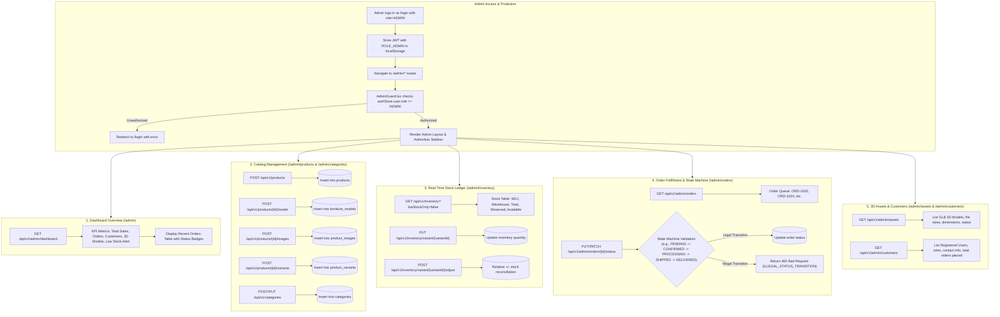

# Admin Operations Flow Diagram

This diagram displays the administrator and staff capabilities, authentication guards, and administrative management workflows for products, 3D digital assets, real-time inventory, orders, and customer accounts.

