# AR & 3D Visualization Flow Diagram

This diagram displays the complete lifecycle of both the **3D Interactive Studio** (room photo backdrop, multi-model placement, dimension locks) and the **Live Camera AR Engine** (WebRTC stream, surface plane detection, green reticle, real-world depth occlusion, lock & nudge transforms).

```mermaid
flowchart TD
    subgraph UserEntry ["Entry Modes"]
        Entry1["Storefront / Products: Click 'View in AR'"] --> ModeChoice{Select Mode}
        Entry2["Top Nav: Click '3D Visualizer' (/visualize)"] --> ModeChoice
        Entry3["Product Detail: Click '3D Studio'"] --> ModeChoice
    end

    subgraph StudioMode ["Mode A: 3D Room Photo Studio (/visualize)"]
        UploadPhoto["Upload Room Background Photo (or Choose Preset)"]
        UploadPhoto --> PresignedReq["Request Presigned URL: POST /api/v1/storage/presigned-upload-url"]
        PresignedReq --> DirectS3["Direct PUT upload to S3/MinIO bucket"]
        DirectS3 --> RecordRoom["Record Room Image: POST /api/v1/rooms"]
        RecordRoom --> SetCanvas["Render Room Photo on Canvas & Align Floor Grid"]

        SetCanvas --> AddModels["Add Furniture from Catalog Sidebar"]
        AddModels --> LoadGLB1["Load GLTF/GLB via ModelLoader.ts"]
        LoadGLB1 --> ApplyPBR["Setup Studio Lighting Rig & Shadow Caster"]
        ApplyPBR --> Manipulate["Transform Controls: Move, Rotate, Dimension-lock Scale"]
        Manipulate --> SaveScene["Click 'Save Design': POST /api/v1/designs"]
        SaveScene --> PersistScene[("Store Scene JSON in visualization_sessions")]
    end

    subgraph CameraARMode ["Mode B: Live Camera AR (CameraARViewer.tsx)"]
        RequestPerm["User Clicks 'Allow Camera Access'"]
        RequestPerm --> WebRTC["navigator.mediaDevices.getUserMedia(video: {facingMode: 'environment'})"]
        WebRTC --> StreamLive["Stream Live Video to HTML5 Video Element"]

        StreamLive --> WebGLOverlay["Three.js Transparent WebGL Overlay on top of Video"]
        WebGLOverlay --> SurfaceManager["ARSurfaceManager: Raycast Floor Plane Tracking"]
        SurfaceManager --> ReticleTarget["Smooth LERP 3D Reticle towards Floor Hit Position"]

        ReticleTarget --> UserTap["User Taps Screen on Detected Surface"]
        UserTap --> SurfaceValidation{"validateSurfacePlacement (Floor vs Wall / Tilt)"}
        
        SurfaceValidation -->|Valid Surface| GroundModel["Position Model at Floor Level (Y=0, Physical Scale 100cm=1m)"]
        SurfaceValidation -->|Invalid Tilt / Not Floor| ShowErrorBanner["Display Warning Banner (e.g. 'Must be on flat floor')"]

        GroundModel --> ApplyOcclusion["ARDepthOcclusion: Hook GPU Depth-Sensing to Mesh Shaders"]
        ApplyOcclusion --> ARControls["AR Floating HUD: Rotate ±45°, Micro-Nudge Arrow Buttons, Lock Position"]
        ARControls --> QuickCart["Click 'Add to Cart • Price' -> Direct Cart sync"]
    end

    ModeChoice -->|Room Photo Mode| StudioMode
    ModeChoice -->|Live Camera AR| CameraARMode
```

