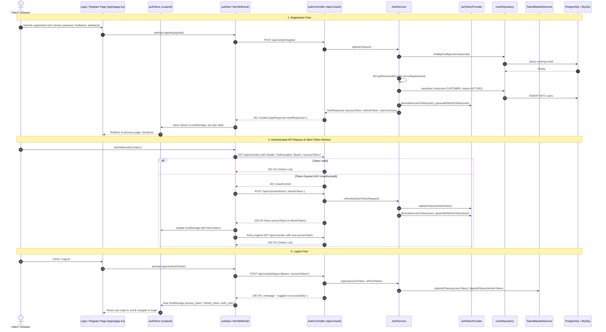

# Authentication Flow Diagram

This diagram displays customer and administrator registration, login, JWT token issuance, silent refresh token rotation, and logout blacklisting in FunArray.

```mermaid
sequenceDiagram
    autonumber
    actor User as Client / Browser
    participant AuthUI as Login / Register Page (login/page.tsx)
    participant AuthStore as authStore (zustand)
    participant AuthAPI as authApi / fetchWithAuth
    participant AuthController as AuthController (/api/v1/auth)
    participant AuthService as AuthService
    participant JwtProvider as JwtTokenProvider
    participant UserRepo as UserRepository
    participant Blacklist as TokenBlacklistService
    participant DB as PostgreSQL / MySQL

    Note over User, DB: 1. Registration Flow
    User->>AuthUI: Submits registration form (email, password, firstName, lastName)
    AuthUI->>AuthAPI: authApi.register(payload)
    AuthAPI->>AuthController: POST /api/v1/auth/register
    AuthController->>AuthService: register(request)
    AuthService->>UserRepo: findByEmailIgnoreCase(email)
    UserRepo->>DB: Query existing email
    DB-->>UserRepo: Empty
    AuthService->>AuthService: BCryptPasswordEncoder.encode(password)
    AuthService->>UserRepo: save(new User(role=CUSTOMER, status=ACTIVE))
    UserRepo->>DB: INSERT INTO users
    AuthService->>JwtProvider: generateAccessToken(user), generateRefreshToken(user)
    AuthService-->>AuthController: AuthResponse (accessToken, refreshToken, userSummary)
    AuthController-->>AuthAPI: 201 Created (ApiResponse<AuthResponse>)
    AuthAPI->>AuthStore: Save tokens to localStorage, set user state
    AuthStore-->>AuthUI: Redirect to previous page / /products

    Note over User, DB: 2. Authenticated API Request & Silent Token Refresh
    User->>AuthAPI: fetchWithAuth('/orders')
    AuthAPI->>AuthController: GET /api/v1/orders with Header "Authorization: Bearer <accessToken>"
    
    alt Token Valid
        AuthController-->>AuthAPI: 200 OK (Orders List)
    else Token Expired (401 Unauthorized)
        AuthController-->>AuthAPI: 401 Unauthorized
        AuthAPI->>AuthController: POST /api/v1/auth/refresh { refreshToken }
        AuthController->>AuthService: refresh(refreshTokenRequest)
        AuthService->>JwtProvider: validateToken(refreshToken)
        AuthService->>JwtProvider: generateAccessToken(user), generateRefreshToken(user)
        AuthController-->>AuthAPI: 200 OK (New accessToken & refreshToken)
        AuthAPI->>AuthStore: Update localStorage with fresh tokens
        AuthAPI->>AuthController: Retry original GET /api/v1/orders with new accessToken
        AuthController-->>AuthAPI: 200 OK (Orders List)
    end

    Note over User, DB: 3. Logout Flow
    User->>AuthUI: Clicks "Logout"
    AuthUI->>AuthAPI: authApi.logout(refreshToken)
    AuthAPI->>AuthController: POST /api/v1/auth/logout (Bearer <accessToken>)
    AuthController->>AuthService: logout(accessToken, refreshToken)
    AuthService->>Blacklist: blacklistToken(accessToken), blacklistToken(refreshToken)
    AuthController-->>AuthAPI: 200 OK { message: "Logged out successfully" }
    AuthAPI->>AuthStore: clear localStorage (access_token, refresh_token, auth_user)
    AuthStore-->>AuthUI: Reset user state to null & navigate to /login
```
