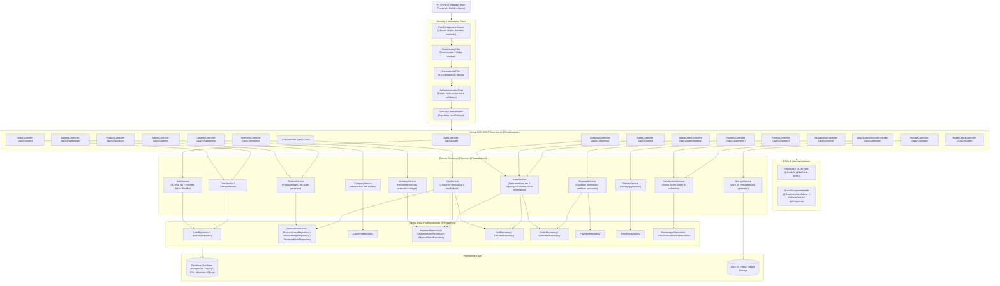

# Backend Architecture Diagram

This diagram displays the Spring Boot 3.3.4 layered architecture implemented in FunArray.

```mermaid
flowchart TD
    ClientRequest["HTTP REST Request (from Frontend / Mobile / Admin)"] --> SecurityLayer

    subgraph SecurityLayer ["Security & Interceptor Filters"]
        CorsFilter["CorsConfigurationSource\n(Allowed origins, headers, methods)"]
        RateLimit["RateLimitingFilter\n(Token bucket / Sliding window)"]
        Correlation["CorrelationIdFilter\n(X-Correlation-ID tracing)"]
        JwtFilter["JwtAuthenticationFilter\n(Bearer token extraction & validation)"]
        UserPrincipalCtx["SecurityContextHolder\n(Populates UserPrincipal)"]
        
        CorsFilter --> RateLimit --> Correlation --> JwtFilter --> UserPrincipalCtx
    end

    subgraph ControllerLayer ["Spring MVC REST Controllers (@RestController)"]
        AuthController["AuthController (/api/v1/auth)"]
        UserController["UserController (/api/v1/users)"]
        AddressController["AddressController (/api/v1/addresses)"]
        ProductController["ProductController (/api/v1/products)"]
        CategoryController["CategoryController (/api/v1/categories)"]
        InventoryController["InventoryController (/api/v1/inventory)"]
        CartController["CartController (/api/v1/cart)"]
        CheckoutController["CheckoutController (/api/v1/checkout)"]
        OrderController["OrderController (/api/v1/orders)"]
        PaymentController["PaymentController (/api/v1/payments)"]
        ReviewController["ReviewController (/api/v1/reviews)"]
        VizController["VisualizationController (/api/v1/rooms)"]
        VizSessionController["VisualizationSessionController (/api/v1/designs)"]
        StorageController["StorageController (/api/v1/storage)"]
        AdminController["AdminController (/api/v1/admin)"]
        AdminOrderController["AdminOrderController (/api/v1/admin/orders)"]
        HealthController["HealthCheckController (/api/v1/health)"]
    end

    UserPrincipalCtx --> ControllerLayer

    subgraph DTOValidationLayer ["DTOs & Jakarta Validation"]
        RequestDTOs["Request DTOs (@Valid, @NotNull, @NotBlank, @Min)"]
        GlobalException["GlobalExceptionHandler\n(@RestControllerAdvice -> ProblemDetails / ApiResponse)"]
    end

    ControllerLayer -.-> DTOValidationLayer

    subgraph ServiceLayer ["Domain Services (@Service, @Transactional)"]
        AuthService["AuthService\n(BCrypt, JWT Provider, Token Blacklist)"]
        UserService["UserService / AddressService"]
        ProductService["ProductService\n(ProductMapper, AR Asset generator)"]
        CategoryService["CategoryService\n(Hierarchical tree builder)"]
        InventoryService["InventoryService\n(Pessimistic locking, reservation ledger)"]
        CartService["CartService\n(Live price verification & stock check)"]
        OrderService["OrderService\n(State machine, tax & shipping calculation, stock reservation)"]
        PaymentService["PaymentService\n(Signature verification, webhook processor)"]
        ReviewService["ReviewService\n(Rating aggregation)"]
        VizService["VisualizationService\n(Scene JSON parser & validation)"]
        StorageService["StorageService\n(AWS S3 Presigned URL generator)"]
    end

    AuthController --> AuthService
    UserController --> UserService
    AddressController --> UserService
    ProductController --> ProductService
    CategoryController --> CategoryService
    InventoryController --> InventoryService
    CartController --> CartService
    CheckoutController --> OrderService
    OrderController --> OrderService
    PaymentController --> PaymentService
    ReviewController --> ReviewService
    VizController --> VizService
    VizSessionController --> VizService
    StorageController --> StorageService
    AdminController --> ProductService
    AdminOrderController --> OrderService

    subgraph RepositoryLayer ["Spring Data JPA Repositories (@Repository)"]
        UserRepo["UserRepository / AddressRepository"]
        ProductRepo["ProductRepository / ProductVariantRepository / ProductImageRepository / FurnitureModelRepository"]
        CategoryRepo["CategoryRepository"]
        InventoryRepo["InventoryRepository / StoreInventoryRepository / PhysicalStoreRepository"]
        CartRepo["CartRepository / CartItemRepository"]
        OrderRepo["OrderRepository / OrderItemRepository"]
        PaymentRepo["PaymentRepository"]
        ReviewRepo["ReviewRepository"]
        VizRepo["RoomImageRepository / VisualizationSessionRepository"]
    end

    AuthService --> UserRepo
    UserService --> UserRepo
    ProductService --> ProductRepo
    CategoryService --> CategoryRepo
    InventoryService --> InventoryRepo
    CartService --> CartRepo
    CartService --> ProductRepo
    CartService --> InventoryRepo
    OrderService --> OrderRepo
    OrderService --> CartRepo
    OrderService --> InventoryRepo
    PaymentService --> PaymentRepo
    PaymentService --> OrderRepo
    ReviewService --> ReviewRepo
    VizService --> VizRepo

    subgraph PersistenceLayer ["Persistence Layer"]
        RDBMS[("Relational Database (PostgreSQL / MySQL)\nJPA / Hibernate / Flyway")]
        S3Bucket[("AWS S3 / MinIO Object Storage")]
    end

    RepositoryLayer --> RDBMS
    StorageService --> S3Bucket
```
