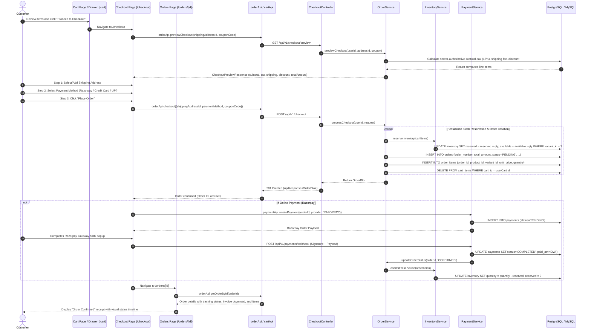

# Cart, Checkout, and Order Flow Diagram

This diagram displays the full commerce journey: adding to cart, managing line items, entering multi-step checkout, validating shipping and discounts, reserving inventory, executing payment, and creating the final order.

