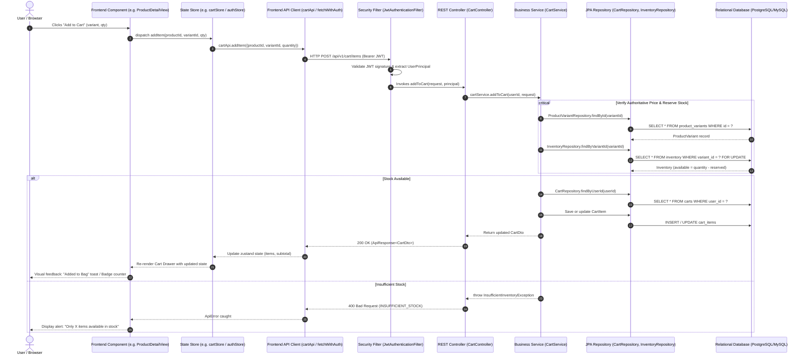

# Component to API Flow Diagram

This diagram displays how user actions on Frontend React components trigger API service functions, pass through Spring Boot Controllers, execute transactional Services, and query JPA Repositories to interact with the Database.

