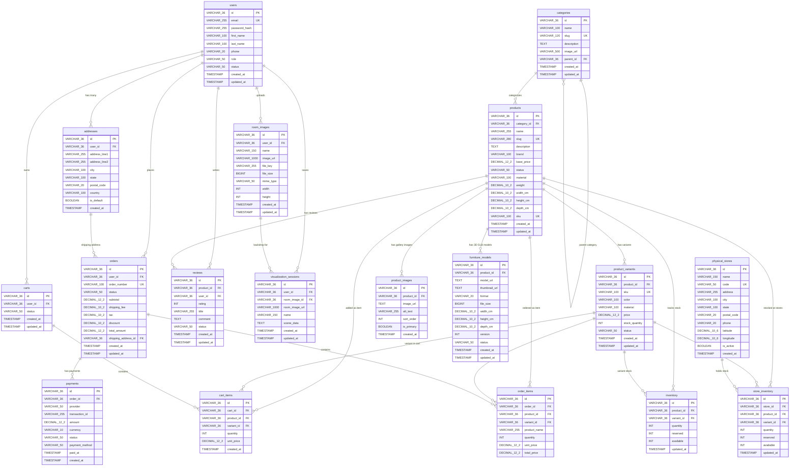

# Database Entity Relationship (ER) Diagram

This diagram represents the actual relational schema derived from Flyway migrations `V1` to `V16` in `backend/src/main/resources/db/migration/`.

```mermaid
erDiagram
    users ||--o{ addresses : "has many"
    users ||--o{ carts : "owns"
    users ||--o{ orders : "places"
    users ||--o{ reviews : "writes"
    users ||--o{ room_images : "uploads"
    users ||--o{ visualization_sessions : "saves"

    categories ||--o{ categories : "parent category"
    categories ||--o{ products : "categorizes"

    products ||--o{ product_variants : "has variants"
    products ||--o{ product_images : "has gallery images"
    products ||--o{ furniture_models : "has 3D GLB models"
    products ||--o{ inventory : "tracks stock"
    products ||--o{ reviews : "has reviews"
    products ||--o{ cart_items : "added as item"
    products ||--o{ order_items : "ordered as item"
    products ||--o{ store_inventory : "stocked at stores"

    product_variants ||--o{ inventory : "variant stock"
    product_variants ||--o{ cart_items : "variant in cart"
    product_variants ||--o{ order_items : "variant in order"
    product_variants ||--o{ store_inventory : "variant store stock"

    carts ||--o{ cart_items : "contains"

    orders ||--o{ order_items : "contains"
    orders ||--o{ payments : "has payments"
    addresses ||--o{ orders : "shipping address"

    physical_stores ||--o{ store_inventory : "holds stock"

    room_images ||--o{ visualization_sessions : "backdrop for"

    users {
        VARCHAR_36 id PK
        VARCHAR_255 email UK
        VARCHAR_255 password_hash
        VARCHAR_100 first_name
        VARCHAR_100 last_name
        VARCHAR_20 phone
        VARCHAR_50 role
        VARCHAR_50 status
        TIMESTAMP created_at
        TIMESTAMP updated_at
    }

    addresses {
        VARCHAR_36 id PK
        VARCHAR_36 user_id FK
        VARCHAR_255 address_line1
        VARCHAR_255 address_line2
        VARCHAR_100 city
        VARCHAR_100 state
        VARCHAR_20 postal_code
        VARCHAR_100 country
        BOOLEAN is_default
        TIMESTAMP created_at
    }

    categories {
        VARCHAR_36 id PK
        VARCHAR_100 name
        VARCHAR_120 slug UK
        TEXT description
        VARCHAR_500 image_url
        VARCHAR_36 parent_id FK
        TIMESTAMP created_at
        TIMESTAMP updated_at
    }

    products {
        VARCHAR_36 id PK
        VARCHAR_36 category_id FK
        VARCHAR_255 name
        VARCHAR_280 slug UK
        TEXT description
        VARCHAR_100 brand
        DECIMAL_12_2 base_price
        VARCHAR_50 status
        VARCHAR_100 material
        DECIMAL_10_2 weight
        DECIMAL_10_2 width_cm
        DECIMAL_10_2 height_cm
        DECIMAL_10_2 depth_cm
        VARCHAR_100 sku UK
        TIMESTAMP created_at
        TIMESTAMP updated_at
    }

    product_variants {
        VARCHAR_36 id PK
        VARCHAR_36 product_id FK
        VARCHAR_100 sku UK
        VARCHAR_100 color
        VARCHAR_100 material
        DECIMAL_12_2 price
        INT stock_quantity
        VARCHAR_50 status
        TIMESTAMP created_at
        TIMESTAMP updated_at
    }

    product_images {
        VARCHAR_36 id PK
        VARCHAR_36 product_id FK
        TEXT image_url
        VARCHAR_255 alt_text
        INT sort_order
        BOOLEAN is_primary
        TIMESTAMP created_at
    }

    furniture_models {
        VARCHAR_36 id PK
        VARCHAR_36 product_id FK
        TEXT model_url
        TEXT thumbnail_url
        VARCHAR_20 format
        BIGINT file_size
        DECIMAL_10_2 width_cm
        DECIMAL_10_2 height_cm
        DECIMAL_10_2 depth_cm
        INT version
        VARCHAR_50 status
        TIMESTAMP created_at
        TIMESTAMP updated_at
    }

    inventory {
        VARCHAR_36 id PK
        VARCHAR_36 product_id FK
        VARCHAR_36 variant_id FK
        INT quantity
        INT reserved
        INT available
        TIMESTAMP updated_at
    }

    carts {
        VARCHAR_36 id PK
        VARCHAR_36 user_id FK
        VARCHAR_50 status
        TIMESTAMP created_at
        TIMESTAMP updated_at
    }

    cart_items {
        VARCHAR_36 id PK
        VARCHAR_36 cart_id FK
        VARCHAR_36 product_id FK
        VARCHAR_36 variant_id FK
        INT quantity
        DECIMAL_12_2 unit_price
        TIMESTAMP created_at
    }

    orders {
        VARCHAR_36 id PK
        VARCHAR_36 user_id FK
        VARCHAR_100 order_number UK
        VARCHAR_50 status
        DECIMAL_12_2 subtotal
        DECIMAL_10_2 shipping_fee
        DECIMAL_10_2 tax
        DECIMAL_10_2 discount
        DECIMAL_12_2 total_amount
        VARCHAR_36 shipping_address_id FK
        TIMESTAMP created_at
        TIMESTAMP updated_at
    }

    order_items {
        VARCHAR_36 id PK
        VARCHAR_36 order_id FK
        VARCHAR_36 product_id FK
        VARCHAR_36 variant_id FK
        VARCHAR_255 product_name
        INT quantity
        DECIMAL_12_2 unit_price
        DECIMAL_12_2 total_price
    }

    payments {
        VARCHAR_36 id PK
        VARCHAR_36 order_id FK
        VARCHAR_50 provider
        VARCHAR_255 transaction_id
        DECIMAL_12_2 amount
        VARCHAR_10 currency
        VARCHAR_50 status
        VARCHAR_50 payment_method
        TIMESTAMP paid_at
        TIMESTAMP created_at
    }

    reviews {
        VARCHAR_36 id PK
        VARCHAR_36 product_id FK
        VARCHAR_36 user_id FK
        INT rating
        VARCHAR_255 title
        TEXT comment
        VARCHAR_50 status
        TIMESTAMP created_at
        TIMESTAMP updated_at
    }

    physical_stores {
        VARCHAR_36 id PK
        VARCHAR_150 name
        VARCHAR_50 code UK
        VARCHAR_255 address
        VARCHAR_100 city
        VARCHAR_100 state
        VARCHAR_20 postal_code
        VARCHAR_20 phone
        DECIMAL_10_6 latitude
        DECIMAL_10_6 longitude
        BOOLEAN is_active
        TIMESTAMP created_at
    }

    store_inventory {
        VARCHAR_36 id PK
        VARCHAR_36 store_id FK
        VARCHAR_36 product_id FK
        VARCHAR_36 variant_id FK
        INT quantity
        INT reserved
        INT available
        TIMESTAMP updated_at
    }

    room_images {
        VARCHAR_36 id PK
        VARCHAR_36 user_id FK
        VARCHAR_150 name
        VARCHAR_1000 image_url
        VARCHAR_255 file_key
        BIGINT file_size
        VARCHAR_50 mime_type
        INT width
        INT height
        TIMESTAMP created_at
        TIMESTAMP updated_at
    }

    visualization_sessions {
        VARCHAR_36 id PK
        VARCHAR_36 user_id FK
        VARCHAR_36 room_image_id FK
        VARCHAR_1000 room_image_url
        VARCHAR_150 name
        TEXT scene_data
        TIMESTAMP created_at
        TIMESTAMP updated_at
    }
```
