# Frontend Architecture Diagram

This diagram displays the frontend structure of FunArray built with **Next.js 16 (App Router)**, **React 19**, **TypeScript**, **Tailwind CSS v4**, **Three.js**, and **Zustand**.

```mermaid
flowchart TD
    subgraph PagesLayout ["Next.js App Router (frontend/src/app)"]
        RootLayout["RootLayout (layout.tsx)\n(DM Serif Display + Inter Fonts, AuthProvider, Navbar, Footer)"]
        HomePage["Home Page (page.tsx)"]
        ProductsPage["Products Catalog (products/page.tsx)"]
        ProductDetailPage["Product Detail (products/[id]/page.tsx)"]
        VisualizePage["3D Room Visualizer (visualize/page.tsx & [productId]/page.tsx)"]
        DesignsPage["Saved Room Designs (designs/page.tsx)"]
        CartPage["Cart Page (cart/page.tsx) & CartDrawer"]
        CheckoutPage["Checkout Stepper (checkout/page.tsx)"]
        OrdersPage["Order History (orders/page.tsx & [id]/page.tsx)"]
        WishlistPage["Wishlist (wishlist/page.tsx)"]
        AuthPages["Auth Pages (login/page.tsx, register/page.tsx)"]
        AdminPages["Admin Portal (admin/layout.tsx & subpages)"]

        RootLayout --> HomePage
        RootLayout --> ProductsPage
        RootLayout --> ProductDetailPage
        RootLayout --> VisualizePage
        RootLayout --> DesignsPage
        RootLayout --> CartPage
        RootLayout --> CheckoutPage
        RootLayout --> OrdersPage
        RootLayout --> WishlistPage
        RootLayout --> AuthPages
        RootLayout --> AdminPages
    end

    subgraph UIComponents ["Component System (frontend/src/components)"]
        UIPrimitives["UI Primitives (components/ui/)\n(Button, Input, Card, Badge, Modal)"]
        LayoutComps["Layout (components/layout/)\n(Navbar, Footer)"]
        HomeComps["Home Components (components/home/)\n(Hero, Categories, Featured, Omnichannel, Testimonials, AR Banner)"]
        ProductComps["Product Components (components/product/)\n(ProductCard, ProductDetailView)"]
        VizComps["3D Visualization (components/visualization/)\n(RoomViewer, ARViewer, FurnitureModel, ModelLoader, FurnitureToolbar, FurnitureControls, FloorAlignment)"]
        ARComps["AR Engine (components/ar/)\n(CameraARViewer, ARPreviewModal, ARSurfaceManager, ARDepthOcclusion)"]
        AdminComps["Admin Primitives (components/admin/)\n(AdminGuard, AdminNav)"]
    end

    subgraph StateManagement ["State & Client Cache (Zustand & Hooks)"]
        AuthStore["authStore / useAuth\n(Token, UserProfile, Role, Login/Logout)"]
        CartStore["cartStore / useCart\n(CartItems, Subtotal, Quantities, Sync with cartApi)"]
        VizStore["visualizationStore / useVisualization\n(RoomImage, PlacedFurniture, Selection, FloorAlignment, Transform)"]
        WishlistStore["wishlistStore / useWishlist\n(Saved product IDs, LocalStorage sync)"]
        CameraARHook["useCameraAR\n(WebRTC Stream, Plane Detection, Occlusion, Nudge)"]
    end

    subgraph APIServices ["API Client Layer (frontend/src/services)"]
        CoreAPI["fetchWithAuth & ApiError (api.ts)\n(JWT Injection, 401 Silent Token Refresh)"]
        AuthAPI["authApi.ts"]
        ProductAPI["productApi.ts"]
        CartAPI["cartApi.ts"]
        OrderAPI["orderApi.ts"]
        PaymentAPI["paymentApi.ts"]
        AddressAPI["addressApi.ts"]
        ReviewAPI["reviewApi.ts"]
        DesignAPI["designApi.ts"]
        VizAPI["visualizationApi.ts"]
        AdminAPI["adminApi.ts"]
    end

    HomePage --> HomeComps
    ProductsPage --> ProductComps
    ProductDetailPage --> ARComps
    ProductDetailPage --> ProductComps
    VisualizePage --> VizComps
    AdminPages --> AdminComps

    HomeComps --> UIPrimitives
    ProductComps --> UIPrimitives
    VizComps --> UIPrimitives
    ARComps --> UIPrimitives

    ProductDetailPage --> VizStore
    VisualizePage --> VizStore
    ARComps --> CameraARHook
    CartPage --> CartStore
    CheckoutPage --> CartStore
    CheckoutPage --> AuthStore
    AdminPages --> AuthStore

    AuthStore --> AuthAPI
    CartStore --> CartAPI
    VizStore --> DesignAPI
    VizStore --> VizAPI
    ProductComps --> ProductAPI
    AdminComps --> AdminAPI

    AuthAPI --> CoreAPI
    ProductAPI --> CoreAPI
    CartAPI --> CoreAPI
    OrderAPI --> CoreAPI
    PaymentAPI --> CoreAPI
    AddressAPI --> CoreAPI
    ReviewAPI --> CoreAPI
    DesignAPI --> CoreAPI
    VizAPI --> CoreAPI
    AdminAPI --> CoreAPI
```

